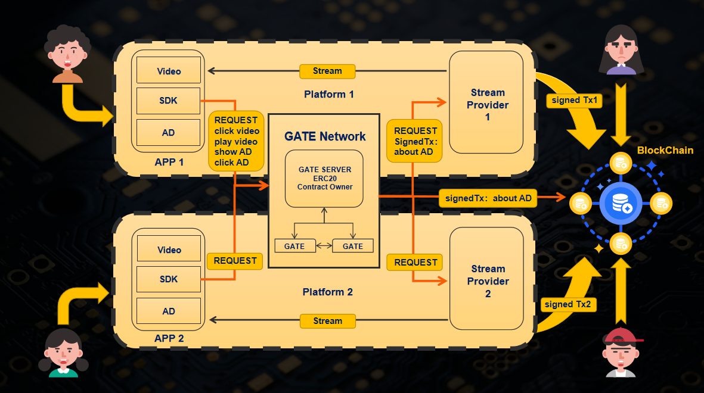

# Frame-flow

**1 项目名称**: frame-flow

**2 项目图片**:

**3 简介**:

该项目是一个去中心化的视频收益分配平台，主要解决目前广告方，视频创作者和视频平台之间的收益分配问题。广告商的支出和创作者的收益不再是完全由视频平台来决定。项目中的 token 不像 defi 项目具有较高的货币属性，用户浏览视频产生的流量以 token 的形式进行价值的转换。项目中的 nft 本身没有价值，只会选择托管方，创作者能够选择将视频托管到能够得到更多分成的平台，打破了生产资料被掌握在资本手中的局面。广告商的每一分钱都花在了广告曝光量上。

主要功能：

1. 当创作者上传视频到平台同时会收到一份 NFT 来作为凭证
2. 用户通过 App 观看视频产生流量的同时，会触发 App 的 sdk 来检测用户行为并向 Gate 发起请求，此时 Gate 会构建一笔 mint 交易 将 token 以 一定的比例发给创造者和视频平台， 并对这笔交易签名之后发送给视频平台，平台会检查这笔交易是否正确，验证通过之后 会将 视频流 推给用户 ，之后视频平台可以随时将该笔交易发送到链上来获取 token
3. 创作者和平台拥有 token 之后，可以将 token 卖给广告商，广告商有了 token 之后就可以在 App 中发布广告，当用户浏览到广告之后，也会向 gate 发起请求，此时 Gate 就会 burn 掉广告商一定量的 token

**4 项目 github repo 链接:**

所有代码都在

- [Github repo](https://github.com/frame-flow/frame-flow)
